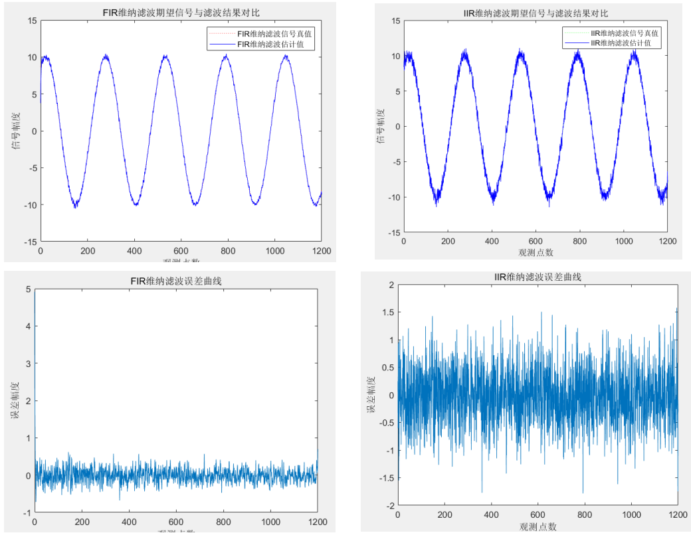

# Data Fusion
> This are code repo for the Data Fusion course in SJTU.
> Live demo [_here_](https://www.example.com). <!-- If you have the project hosted somewhere, include the link here. -->

## Table of Contents
* [General Info](#general-information)
* [Optimal Estimation](#optimal-estimation)
* [Features](#features)
* [Screenshots](#screenshots)
* [Setup](#setup)
* [Usage](#usage)
* [Project Status](#project-status)
* [Room for Improvement](#room-for-improvement)
* [Acknowledgements](#acknowledgements)
* [Contact](#contact)
<!-- * [License](#license) -->

## Optimal Estimation
### Problem description
Suppose a voltage is a random variable $X$ with normal distribution, the mean value is $5$, and the variance is $0.1$; The random variable x is measured $20$ times by two instruments, and the measurement error of the two instruments is assumed to be a normally distributed random variable with a mean value of $0$ and a variance of $0.1$ and $0.4$ respectively. Caculate the least square estimation (LSE), weighted least square estimation (WLS) and linear minimum variance estimation (LMMSE) of $X$, and calculate the mean square error of the corresponding estimation. Let the measurement equation be $Z=HZ+V$.

### Usage
To handle the problem, run the following file:

`1/code_1/main123.m`

### Result
|  Method   | $\hat{X}$ estimation  |MSE|
| :-----| :----: | :----:|
| LSE  | 5.0615 |0.0063|
| WLS  | 5.0292 |0.0040|
| LMMSE  | 5.0281 |0.0038|

<!-- You don't have to answer all the questions - just the ones relevant to your project. -->

## Wiener Filter
### problem description
Let $y (n) =x (n) +v (n)$, where $x(n)=10sin(\frac{\pi n}{128}+\frac{\pi}{3})$,$v(n)$
is white noise with variance of $1.25$. Design FIR and IIR Wiener filter to estimate the signal $x (n)$.
### Usage
To handle the problem, run the following file:

`1/code_1/main.m`

### Result

## Kalman Filter

### Basic Kalman Filter
`1/code_3/kalman.m`
### Constant Gain Kalman Filter
`1/code_3/kalman_constant_gain.m`
### Square root Kalman Filter
`1/code_3/kalman_sqrt.m`
### Forgetting Factor Kalman Filter
`1/code_3/kalman_forgetting_factor.m`
### Adaptive Kalman Filter
`1/code_3/kalman_adaptive.m`
### Limited K Reduction Kalman Filter
`1/code_3/kalman_restain_K.m`

## Setup
What are the project requirements/dependencies? Where are they listed? A requirements.txt or a Pipfile.lock file perhaps? Where is it located?

Proceed to describe how to install / setup one's local environment / get started with the project.

## Usage
How does one go about using it?
Provide various use cases and code examples here.

`write-your-code-here`

## Project Status
Project is: _in progress_ / _complete_ / _no longer being worked on_. If you are no longer working on it, provide reasons why.

## Room for Improvement
Include areas you believe need improvement / could be improved. Also add TODOs for future development.

Room for improvement:
- Improvement to be done 1
- Improvement to be done 2

To do:
- Feature to be added 1
- Feature to be added 2

## Acknowledgements
Give credit here.
- This project was inspired by...
- This project was based on [this tutorial](https://www.example.com).
- Many thanks to...

## Contact
Created by [@flynerdpl](https://www.flynerd.pl/) - feel free to contact me!

<!-- Optional -->
<!-- ## License -->
<!-- This project is open source and available under the [... License](). -->

<!-- You don't have to include all sections - just the one's relevant to your project -->
